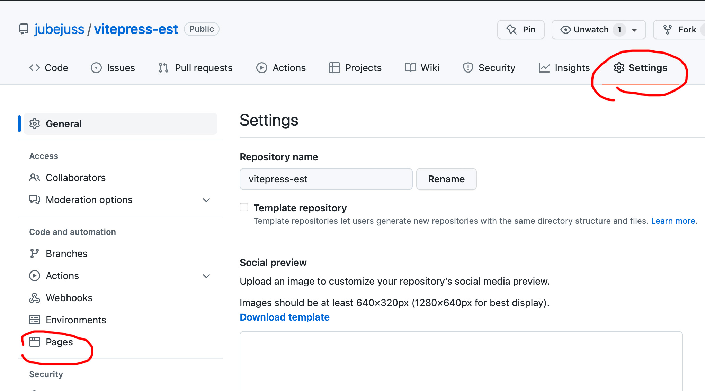
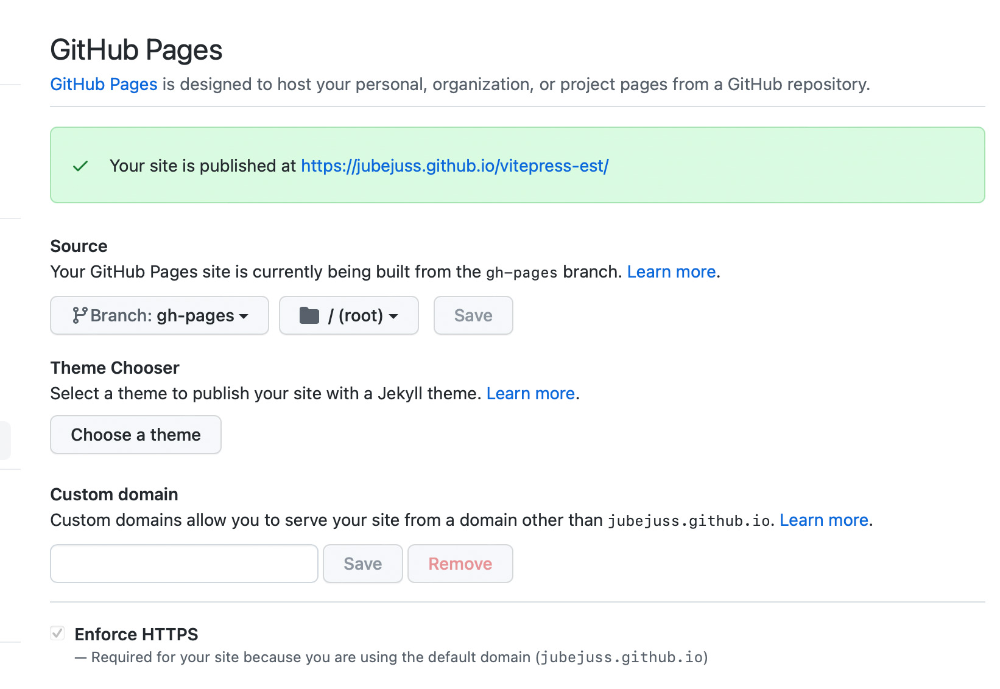

# Lähme laivi

Pole vast paha mõte testida kohe alguses ära ka laivkeskkond.

Eelnevaga saime püsti arenduskekskonna. Laivi minekuks on tarvis genereerida staatiline leht. Selleks on `package.json` failis defineeritud käsklus `build` ehk jooksutame terminalis `npm run build`, mis genereerib meile `docs/.vitepress/dist`folderi, milles ongi avaldamiskõlbulik veeb.

## Base

Et leht laivis korrektselt tööle hakkaks, tuleb `conf.js` failis näidata ära baasaadress. Meie näite puhul githubis, on see sama, mis repo nimi `vitepress-est`:

```javascript
module.exports = {
  title: "Minu dokuveeb",
  base: "/vitepress-est/",
  themeConfig: {
    nav: [{ text: "Esileht", link: "/" }],
  },
};
```

## Github pages

Et elu lihtsamaks teha, võime seadistada käsufaili, mis genereerib distfolderi ja saadab selle ka serverisse vms kohta, kus leht avaldatakse.

Siin näites kasutame github pages'it.  
Muud erinevad võimalused on ära toodud Vitepressi enda juhendis siin: [Vitepressi juhend](https://vitepress.vuejs.org/guide/deploy.html)

## `deploy.sh`

Oma projekti juurkataloogi loome faili `deploy.sh`, millesse kirjutame vajalikud käsud:

- töö katkestamine errori korral
- build käskluse jooksutamine

* liikumine loodud dist folderisse
* uue giti loomine
* uude gitti dist folderi saatmine
* naasmoine tagasi juurkataloogi
  ehk:

```bash
# katkesta kui error
set -e

# loo staatiline veebileht
npm run build

# liigu loodu kausta
cd docs/.vitepress/dist

# loo uus git
git init
git add -A
git commit -m 'deploy'

# saada leht githubi, gh-pages branchi
git push -f git@github.com:jubejuss/mm20doku.git master:gh-pages

#liigu tagasi
cd -
```

## Seadistamine github'is

Ava githubis repo settings ja seejärel pages:


Avanema peakski juba avaldamiskõlbulike sätetega pilt:

