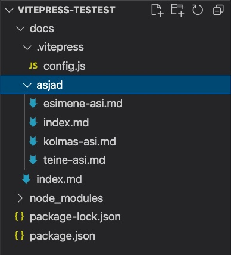
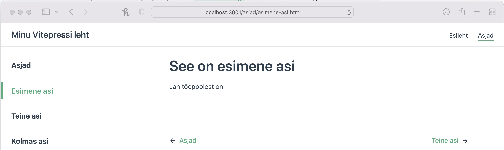

# No kuidas, kurat?

## Vaatame siis

Vitepressi install on lihtne, mina tegin asja siitkaudu [Vitepress'i inimkeelne juhend ingliskeeles](https://learnvue.co/2021/01/write-beautiful-documentation-quickly-with-vitepress/#so-what-is-vitepress)

Sellel lehel teen selle asja läbi eesti keeles, et neil, kellele [Vue](https://v3.vuejs.org/guide/introduction.html) on tundmata ja ingliskeel kah mitte kõige kobedam, oleks lihtsam asi kasutusele võtta.

### Asja juurde

Vue on javascripti raamistik ja mässamiselks on tarvilik [Node](https://nodejs.org/en/).  
Node installiks peaks ehk tegema siia lisajuhendi (see pole raketiteadus), seega kui menüüribal see olemas on, siis järelikult olen juba teinud.

Kui Node installitud ja arusaadav või ka mitte, tuleks tema abil initsialiseerida node pakk – package.json. Tegemist on failiga, kus kirjas kõik kasutatud Node moodulid, vajalikud jubinad, skriptid jne.

Selleks peaks olema või peaks tegema projekti jaoks folderi, millisel on adekvaatne nimi (nii, et poole aasta pärast ei peaks te mõistatama, kust oma projekti otsima). Käesoleva projekti nimeks panen ma `vitepress-est`. Vaikimisi paneb Node js nimeks folderi nime.

**Avame terminali ja...**

**initsialiseerime (kes teab õiget eesti keelset vastet, kirjutagu):**

```javascript
npm init
```

Selle protsessi käigus küsib Node, mida ja kuidas projektis nimetada. Üldiselt sobib vaikimisi valik, mistap võite kasutada ka käsklust `npm init -y`.  
`-y`tähendab jess, ehk olete vaikimis valikutega nõus.

**installime vitepress'i:**

```javascript
npm i --save-dev vitepress
```

Sellega on vajalik installitud, jääb vaid üle asi tööle panna ja ilusaks teha.

Et Vitepress käivitada, peame `npm init` käsu tagajärjel tekitatud `package.json`-isse kirjutama programmi käivitusskriptid. Selleks ava `package.json` ja kirjuta `test`skripti asemele see:

```javascript
"scripts": {
  "dev": "vitepress dev docs",
  "build": "vitepress build docs",
  "serve": "vitepress serve docs"
}
```

`dev` on development, ehk arendus, `build` genereerib teile valmis staatilise lehe ja `serve` abil saab testida lokaalselt, kuis meil asi välja näeb (vist).

### Sisu

Hetkel meil lehel veel mingit sisu pole. Sisu tekitamiseks, peame looma projekti `docs` kausta ja selle sisse `index.md`faili. Selle faili sisse võite kirjutada näiteks:

```markdown
# Mina olen pealkiri

mina olen tavaline tekst
```

Ja nüüd võime oma lehte vaadata. Selleks käivitame terminalis Node abil oma `package.json`isse kirjutatud scripti:

```bash
npm run dev
```

ja avame veebibrauseris oma lehe aadressil: `http://localhost:3000/`
Kui kõik hästi, peaksite nägema umbes sellist tulemust:


Vitepressi leht jaguneb kolmeks – menüüriba, vasakul asetsev külgriba ning sisuosa.

Vasakul asetsevale küljeribale ilmuvad pealkirjad, mis on ühtlasi ka lingid sisusse, automaatselt kui te kasutate oma markdown failides # tähistatud pealkirju.

Markdownis on # h1, ## h2, ## h3 jne ja alates h2, lisatakse pealkiri küljeribale. Seega, kui te avate taas oma `docs` kataloogis asuva `index.md` ja lisate sinna:

```markdown
# Mina olen pealkiri

mina olen tavaline tekst

<!-- lisame -->

## Mina olen h2 pealkiri

see pealkiri läheb ka küljemenüüsse

## Mina olen ka h2 pealkiri

See läheb ka küljemenüüsse

### Mina olen h3 pealkiri

isegi see läheb küljemenüüsse
```

Saate umbes sellise veebilehe, kus pealkirjad ka küljeribal ning need on ka klikatavad:


### Lehe nimi ja muud tähtsad parameetrid

Lehe nime muutmiseks ja ka muudeks tähtsateks mudimisteks, tulenb meil meelitada peidust välja vitepressi konfiguratsioonifail.

Selleks loome `docs` kausta peidetud kausta `.vitepress`, millesse loome faili `config.js`.

Sellesse kirjutame:

```javascript
module.exports = {
  title: 'Minu Vitepressi leht', // See kirjutatakse kõikide lehtede päisesse ja samuti ka menüüribale
};
```

Nüüd peaksite nägema, et menüüribal vasakul olev tekst muutus:  
  
Hiljem lisame siia ka logo.

### Menüüriba

Nüüd aga loome erinevad jaotused, ehk lisame lehekülje päsiesse ka menüü

Esmalt tekitame erinevad jaotused, ehk loome `docs` kausta alamkaustad ja sisud. Siinse näite puhul lisame ühe kausta - `asjad` ning loome sellesse `index.md`, `esimene-asi.md`, `teine-asi.md` ja `kolmas-asi.md`.

Kõigisse md failidesse kirjiutame ka midagi – `# pealkiri`, ehk h1 pealkiri ning järgmistele ridadele mingi sisutekst.  
Sellega on meil `docs` kaustas `asjad` kaust, milles omakorda sellised failid:


Nüüd saame luua menüüriba.  
Selleks lisame `config.js` faili:

```javascript
module.exports = {
  title: 'Minu Vitepressi leht', // See kirjutatakse kõikide lehtede päisesse ja samuti ka menüüribale
  // uus osa
  themeConfig: {
    nav: [
      { text: 'Esileht', link: '/' },
      { text: 'Asjad', link: '/asjad/' },
    ],
  },
};
```

Säherduse tegevuse tagajärjel tekibki meile üles paremale menüüriba ja muidugi ka asjad lehe index.md sisu:


### Küljeribale erinevad leheküljed

Me lõime asjad kausta mitu md faili. Need kõik saame lisada ka küljeribale. Selleks peame lisama `config.js` faili küljeriba info:

```javascript
module.exports = {
  title: 'Minu Vitepressi leht', // See kirjutatakse kõikide lehtede päisesse ja samuti ka menüüribale

  themeConfig: {
    nav: [
      { text: 'Esileht', link: '/' },
      { text: 'Asjad', link: '/asjad/' },
    ],
    // uus osa
    sidebar: [
      { text: 'Asjad', link: '/asjad/' },
      { text: 'Esimene asi', link: '/asjad/esimene-asi' },
      { text: 'Teine asi', link: '/asjad/teine-asi' },
      { text: 'Kolmas asi', link: '/asjad/kolmas-asi' },
    ],
  },
};
```

Nagu aru võite saada, öeldakse `text:` võtmega lingi nimi ja `link:` võtmega aadress, kuhu klikates liikuda. Need on siis meie failide nimed ja asukohad.

Selle tegevuse tagajärjel kuvatakse küljeribal meie poolt lisatud lingid:


Ainus jama, et need on nüüd kõikidel lehtedel, mitte vaid `Asjad` menüüjaotuses.

### Igal lehel oma küljemenüü

Selleks, et konkreetse lehe küljemenüü oleks vaid sellel lehel, võtame kasutusel muutujad ja defineerime need `config.js` failis ning allpool, enne defineeritud `sidebar:` osakonnas näitame, et süsteem kasutaks vastavat muutujat:

```javascript
// uus osa
const primarySidebar = [
  { text: 'Asjad', link: '/asjad/' },
  { text: 'Esimene asi', link: '/asjad/esimene-asi' },
  { text: 'Teine asi', link: '/asjad/teine-asi' },
  { text: 'Kolmas asi', link: '/asjad/kolmas-asi' },
];

module.exports = {
  title: 'Minu Vitepressi leht', // See kirjutatakse kõikide lehtede päisesse ja samuti ka menüüribale

  themeConfig: {
    nav: [
      { text: 'Esileht', link: '/' },
      { text: 'Asjad', link: '/asjad/' },
    ],
    // uus osa
    sidebar: {
      '/asjad/': primarySidebar,
    },
  },
};
```

Sellega ongi meil esialgne setap tehtud.
