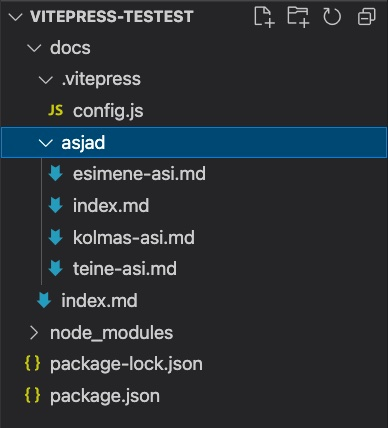
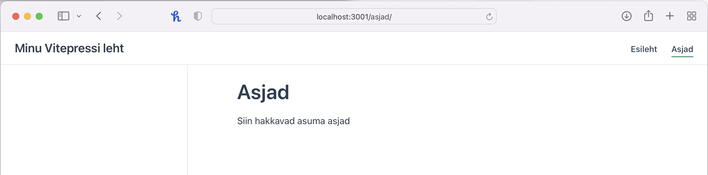
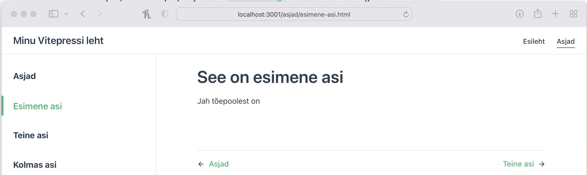

# Peamenüü

Nüüd aga loome erinevad jaotused, ehk lisame lehekülje päsiesse ka menüü

Esmalt tekitame erinevad jaotused, ehk loome `docs` kausta alamkaustad ja sisud. Siinse näite puhul lisame ühe kausta - `asjad` ning loome sellesse `index.md`, `esimene-asi.md`, `teine-asi.md` ja `kolmas-asi.md`.

Kõigisse md failidesse kirjiutame ka midagi – `# pealkiri`, ehk h1 pealkiri ning järgmistele ridadele mingi sisutekst.  
Sellega on meil `docs` kaustas `asjad` kaust, milles omakorda sellised failid:


Nüüd saame luua menüüriba.  
Selleks lisame `config.js` faili:

```javascript
module.exports = {
  title: "Minu Vitepressi leht", // See kirjutatakse kõikide lehtede päisesse ja samuti ka menüüribale
  // uus osa
  themeConfig: {
    nav: [
      { text: "Esileht", link: "/" },
      { text: "Asjad", link: "/asjad/" },
    ],
  },
};
```

Säherduse tegevuse tagajärjel tekibki meile üles paremale menüüriba ja muidugi ka asjad lehe index.md sisu:


## Küljeribale erinevad leheküljed

Me lõime asjad kausta mitu md faili. Need kõik saame lisada ka küljeribale. Selleks peame lisama `config.js` faili küljeriba info:

```javascript
module.exports = {
  title: "Minu Vitepressi leht", // See kirjutatakse kõikide lehtede päisesse ja samuti ka menüüribale

  themeConfig: {
    nav: [
      { text: "Esileht", link: "/" },
      { text: "Asjad", link: "/asjad/" },
    ],
    // uus osa
    sidebar: [
      { text: "Asjad", link: "/asjad/" },
      { text: "Esimene asi", link: "/asjad/esimene-asi" },
      { text: "Teine asi", link: "/asjad/teine-asi" },
      { text: "Kolmas asi", link: "/asjad/kolmas-asi" },
    ],
  },
};
```

Nagu aru võite saada, öeldakse `text:` võtmega lingi nimi ja `link:` võtmega aadress, kuhu klikates liikuda. Need on siis meie failide nimed ja asukohad.

Selle tegevuse tagajärjel kuvatakse küljeribal meie poolt lisatud lingid:


Ainus jama, et need on nüüd kõikidel lehtedel, mitte vaid `Asjad` menüüjaotuses.

## Igal lehel oma küljemenüü

Selleks, et konkreetse lehe küljemenüü oleks vaid sellel lehel, võtame kasutusel muutujad ja defineerime need `config.js` failis ning allpool, enne defineeritud `sidebar:` osakonnas näitame, et süsteem kasutaks vastavat muutujat:

```javascript
// uus osa
const primarySidebar = [
  { text: "Asjad", link: "/asjad/" },
  { text: "Esimene asi", link: "/asjad/esimene-asi" },
  { text: "Teine asi", link: "/asjad/teine-asi" },
  { text: "Kolmas asi", link: "/asjad/kolmas-asi" },
];

module.exports = {
  title: "Minu Vitepressi leht", // See kirjutatakse kõikide lehtede päisesse ja samuti ka menüüribale

  themeConfig: {
    nav: [
      { text: "Esileht", link: "/" },
      { text: "Asjad", link: "/asjad/" },
    ],
    // uus osa
    sidebar: {
      "/asjad/": primarySidebar,
    },
  },
};
```
